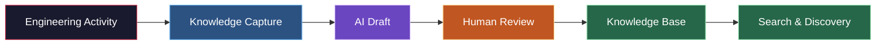
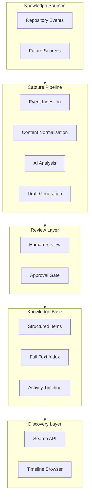

<p align="center">
  <picture>
    <source media="(prefers-color-scheme: dark)" srcset="frontend/KWLogobg.png">
    
  </picture>
</p>

<p align="center">
  A platform that captures and preserves engineering knowledge from your development workflow.
</p>

<p align="center">
  <a href="#"></a>
  <a href="#"></a>
  <a href="#"></a>
  <a href="#"></a>
  <a href="#"></a>
  <a href="#"></a>


</p>

---

KNOWell is an open-source platform that captures engineering knowledge from your existing development workflow and makes it searchable. It analyses commits and pull requests, generates structured knowledge drafts using AI, and provides a review workflow so your team can curate what enters the knowledge base.

The goal is to help teams preserve the context behind their code — the decisions, trade-offs, and rationale that are routinely lost as projects evolve and team members move on.

---

## How It Works



1. Engineering activity is detected from connected sources
2. KNOWell generates a structured draft with title, summary, importance rating, decision record, and onboarding notes
3. A human reviews the draft — approving, rejecting, or leaving it for later
4. Approved drafts become permanent knowledge items in a searchable knowledge base
5. Knowledge is discoverable via full-text search and the project timeline

---

## Current Features

### Knowledge Capture

Detects meaningful engineering activity and generates structured drafts. Each draft contains a title, summary, importance rating (1-4), engineering decision record in markdown, and an AGENTS.md entry for future contributors. Trivial changes (formatting, dependency updates, typo fixes) are automatically skipped.

### Review Workflow

Drafts start in a "draft" state. Team members with appropriate roles (owner, tech lead, developer) can approve, reject, or mark items for review. Nothing enters the knowledge base without human approval.

### Knowledge Base

Approved items are stored as structured knowledge entries. Each entry preserves the decision context, implementation rationale, and links back to the original source activity. The knowledge base uses PostgreSQL full-text search with GIN indexes.

### Search and Discovery

Full-text search across all knowledge items. Supports filtering by project, date range, and sorting by newest, oldest, importance, or source.

### Project Timeline

A chronological activity feed showing commits, pull requests, draft generations, approvals, and member activity. Deduplication prevents redundant entries.

### Collaboration

Workspaces and projects organise knowledge into logical groups. Role-based access control (owner, tech lead, developer, viewer) controls who can review and approve. Invitation system supports email-based team invitations.

---

## Knowledge Sources

| Source | Status |
|---|---|
| GitHub repository activity (commits, pull requests, merges) | Available now |
| Manual knowledge notes | Planned |
| Architecture Decision Records | Planned |
| GitLab repositories | Planned |
| Bitbucket repositories | Planned |
| Slack / Discord | Planned |
| Jira / Linear | Planned |

---

## Architecture



The backend is a modular monolith written in Go. As new knowledge sources are added, they integrate into the same pipeline without architectural changes.

---

## Tech Stack

| Layer | Technology |
|---|---|
| Frontend | React 19, TypeScript, Vite 6, React Router 6 |
| Backend | Go 1.24, Chi router v5 |
| Database | PostgreSQL 16+ (full-text search, pgcrypto) |
| Authentication | JWT (golang-jwt/v5), bcrypt |
| AI Provider | Google Gemini 2.0 Flash (extensible interface) |
| AI Fallback | Built-in keyword analyser (works without API key) |
| Migrations | golang-migrate/migrate v4 |
| Containerization | Docker, Docker Compose |
| Frontend Hosting | Vercel-ready |

---

## Quick Start

### Prerequisites

- Go 1.24+
- Node.js 20+
- PostgreSQL 16+

### Setup

```bash
# Clone the repository
git clone https://github.com/gitXsingh/knowell.git
cd knowell

# Configure environment
cp .env.example .env
# Edit .env with your database URL and other settings

# Start the backend
cd backend
go run ./cmd/api

# In a separate terminal, start the frontend
cd frontend
npm install
npm run dev
```

Open `http://localhost:3000` to access the application.

### Docker

```bash
docker compose up --build
```

---

## Environment Variables

| Variable | Required | Default | Purpose |
|---|---|---|---|
| `APP_ENV` | No | `development` | Runtime environment |
| `APP_ADDR` | No | `:8080` | Backend listen address |
| `DATABASE_URL` | Yes | — | PostgreSQL connection string |
| `MIGRATIONS_DIR` | No | `./migrations` | Path to SQL migrations |
| `JWT_SECRET` | Yes | — | JWT signing key |
| `JWT_ACCESS_TTL` | No | `24h` | Session duration |
| `GEMINI_API_KEY` | No | — | Google Gemini API key (omit for built-in fallback) |
| `GEMINI_MODEL` | No | `gemini-2.0-flash` | AI model name |
| `VITE_API_BASE` | Yes (frontend) | `http://localhost:8080` | Backend URL for the frontend |

See `.env.example` for additional configuration options.

---

## Project Structure

```
knowell/
├── backend/
│   ├── cmd/api/main.go          # Application entry point
│   ├── internal/
│   │   ├── ai/                  # AI analysis and draft generation
│   │   ├── auth/                # Authentication and session management
│   │   ├── common/              # Config, database, server bootstrap
│   │   ├── knowledge/           # Knowledge base CRUD and promotion
│   │   ├── project/             # Project configuration and membership
│   │   ├── search/              # Full-text knowledge search
│   │   ├── timeline/            # Project activity history
│   │   ├── webhook/             # Event ingestion pipeline
│   │   └── workspace/           # Workspace management
│   ├── migrations/              # SQL schema migrations
│   └── Dockerfile
├── frontend/
│   ├── src/
│   │   ├── components/          # Reusable UI components
│   │   ├── lib/                 # API client, auth hooks, utilities
│   │   ├── pages/               # Route pages
│   │   └── styles/              # Design system styles
│   ├── public/logo.png
│   └── Dockerfile
├── docs/                        # Architecture, API spec, database docs
├── docker-compose.yml
├── .env.example
└── vercel.json
```

---

## Roadmap

### Available Now

- Knowledge capture from repository activity (commits, pull requests, merges)
- AI-powered draft generation (Gemini API + built-in fallback)
- Human review workflow with role-based approval
- Structured knowledge base with full-text search
- Project activity timeline
- Team collaboration with workspaces and roles
- Docker Compose deployment

### In Progress

- Dark mode
- Knowledge item editing and versioning
- Manual knowledge entry
- Admin dashboard

### Planned

- Knowledge categories and tagging
- Semantic search (pgvector)
- Notifications for pending reviews
- Knowledge export (markdown, JSON, PDF)
- Multiple sources per project
- SSO / OIDC authentication
- GitLab and Bitbucket repositories
- Slack and Discord integration
- Jira / Linear integration
- Architecture Decision Record support
- Self-hosted AI models (Ollama, LocalAI)
- Public API and SDKs

---

## Contributing

Bug reports, feature requests, and pull requests are welcome.

- **Report a bug** — open an issue with steps to reproduce
- **Suggest a feature** — open an issue describing the use case
- **Submit code** — fork the repository, create a branch, and open a pull request
- **Improve documentation** — corrections and clarifications are appreciated

For code contributions, follow the existing patterns in the codebase. The Go backend uses standard library conventions. The TypeScript frontend uses React patterns consistent with the existing components.

---

## Security

If you discover a security vulnerability, please report it privately via a [GitHub Security Advisory](https://docs.github.com/en/code-security/security-advisories/guidance-on-reporting-and-writing-information-about-vulnerabilities) rather than opening a public issue.

---

## License

KNOWell is released under the [MIT License](LICENSE).

---

If you find this project useful, consider starring the repository or contributing.
